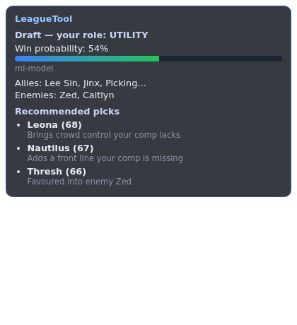
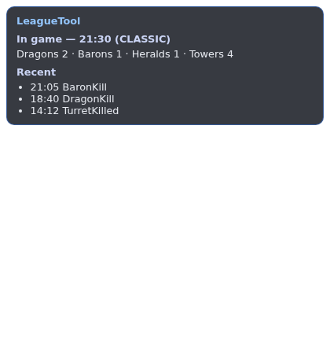
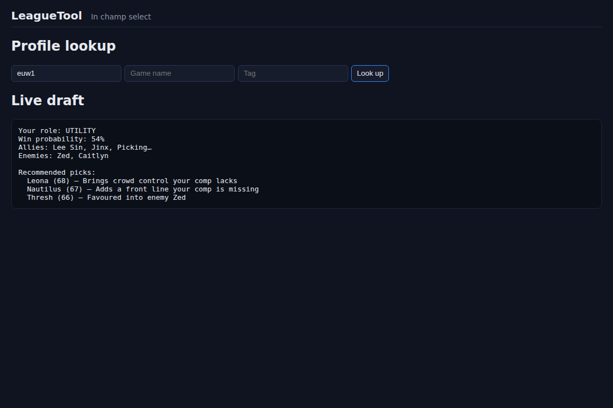

# LeagueTool

A compliance-first **League of Legends companion**: player profiles, recent-form / tilt scoring,
a draft analyzer with a **champion pick recommender**, an ML win-probability model, and an
in-game Electron overlay driven by Riot's local APIs.

> Built to stay inside Riot's rules: no memory reading, no injection, and **ranked enemy/teammate
> identities stay anonymous** in Solo/Flex champ select. See [`docs/COMPLIANCE.md`](docs/COMPLIANCE.md).

---

## What it does (scope)

### In scope — compliant & buildable
- **Player profile lookup** by Riot ID → ranked stats, recent match history, champion mastery.
- **Recent-form / "tilt" score** for any player you legitimately have the ID for (your own party, or a manual search).
- **Draft analyzer** for your own champ select: synergy, counters, role/damage coverage, and a
  **comp-vs-comp win probability** (ML).
- **Champion pick recommender** — given allies + enemies already picked, score every champion you
  could pick for your open role (win-rate × counter × synergy) and return a ranked shortlist with reasons.
- **In-game overlay** via the Live Client Data API (jungle timers, comp reminders, etc.).
- **Champ-select scouting** in normal/draft modes (names are visible there) and for your premade party in ranked.

### Out of scope — policy / anti-cheat enforced (we do **not** build these)
- Revealing random teammates' names/stats in **ranked** champ select.
- Auto "dodge this teammate" recommendations in ranked (requires de-anonymization → anti-cheat territory).
- Any memory reading or client injection.

---

## Screenshots

| Champ-select overlay | In-game overlay | Main window |
|---|---|---|
|  |  |  |

_Rendered from the real renderer with sample data (regenerate with `xvfb-run electron scripts/screenshot.mjs --no-sandbox` in `desktop/`)._

## Architecture

A polyglot monorepo. Each layer is independently buildable and testable.

| Layer | Tech | Directory |
|------|------|-----------|
| **Backend API** | Java 21 + **Spring Boot 3** (Maven) | [`backend/`](backend/) |
| **ML service** | Python 3.11 + FastAPI + LightGBM/XGBoost + scikit-learn | [`ml-service/`](ml-service/) |
| **Desktop client / overlay** | **Electron** + LCU API + Live Client Data API | [`desktop/`](desktop/) |
| **Data stores** | PostgreSQL (match data, computed stats) + Redis (cache + rate-limit buckets) | [`infra/`](infra/) |
| **Static game data** | Data Dragon / Community Dragon (champions, items, spells, icons) | fetched & cached |

```
                 ┌──────────────────────────┐
                 │   Electron desktop app    │  LCU (lockfile+WS) · Live Client Data (127.0.0.1:2999)
                 │  overlay · champ select   │
                 └────────────┬─────────────┘
                              │ HTTPS (REST/WS)
                 ┌────────────▼─────────────┐        ┌───────────────────────┐
                 │   Spring Boot backend    │  REST  │   Python ML service    │
                 │  profiles · form · draft │◄──────►│  win-prob inference    │
                 │  pick recommender · cache │        │  LightGBM (calibrated) │
                 └───┬───────────┬──────────┘        └──────────┬────────────┘
       rate-limited  │           │ cache                          │ trains on
        Riot API ◄───┘     ┌─────▼─────┐  ┌──────────┐            ▼
   (Account/Summoner/      │  Postgres │  │  Redis    │      crawled matches
    League/Match/Mastery)  └───────────┘  └──────────┘       (Match-V5)
```

See [`docs/ARCHITECTURE.md`](docs/ARCHITECTURE.md) for details and [`docs/ROADMAP.md`](docs/ROADMAP.md) for phases.

---

## Riot API endpoints used

`Account-V1` (Riot ID ↔ PUUID) · `Summoner-V4` · `League-V4` (ranked) · `Match-V5` (history + crawl) ·
`Champion-Mastery-V4`. Plus **Data Dragon** for static champion metadata (no key required).

**Rate-limit survival is a first-class concern.** Every outbound Riot call goes through a
rate-limited request queue with exponential backoff on `429` and aggressive caching. The limiter
and cache are in-process by default; set `REDIS_ENABLED=true` to share one budget and cache across
instances via Redis token buckets. The goal is **zero 429-driven outages**.

---

## Quick start (local dev)

Prereqs: JDK 21, Maven 3.9+, Python 3.11+, Node 20+, Docker.

```bash
# 1. Bring up Postgres + Redis
docker compose -f infra/docker-compose.yml up -d

# 2. Configure your Riot API key (never commit it)
cp .env.example .env
#   edit .env and set RIOT_API_KEY=...

# 3. Backend
cd backend && ./run.sh            # or: RIOT_API_KEY=... mvn spring-boot:run

# 4. ML service
cd ml-service && make dev          # FastAPI on :8001

# 5. Desktop (Electron)
cd desktop && npm install && npm run dev
```

> **Secrets:** the Riot API key is read from the `RIOT_API_KEY` environment variable only.
> It is never committed. `.env`, lockfiles, and `application-local.yml` are git-ignored.

---

## ML model — honest expectations

Comp-only win prediction tops out around **51–55%**. Adding player champion-mastery / skill
features pushes it to **~60%**. Anything claiming more pre-game is overselling. The UI presents
the model as a soft "slight edge" bar with the synergy/counter reasons behind it — never a
confident verdict. Probabilities are **calibrated** (isotonic) so "58%" means 58%.

A **baseline model ships with the repo** (`ml-service/models/winprob_model.pkl`), trained on a
1500-game ranked crawl — held-out accuracy ≈ **54%**, ECE ≈ 0.02 — so win-probability works on a
fresh clone. Retrain on a larger corpus any time with `scripts/crawl_and_train.sh`.

---

## Backend API (v1)

| Method & path | Purpose |
|---|---|
| `GET /api/v1/profiles/{platform}/{gameName}/{tagLine}` | Profile: ranked, last-N matches, top mastery |
| `GET /api/v1/form/{platform}/{gameName}/{tagLine}` | Recent-form / tilt score with breakdown |
| `GET /api/v1/champions` (`?role=`) · `GET /api/v1/champions/{id}` | Champion metadata |
| `POST /api/v1/draft/analyze` | Comp snapshot, synergy, counter threats, coverage |
| `POST /api/v1/draft/recommend` | **Pick recommender**: ranked champs for your open role + reasons |
| `POST /api/v1/draft/win-probability` | Comp-vs-comp win probability (ML service) |
| `POST /api/v1/admin/crawl` | Operator: bounded Match-V5 crawl (ranked SR only) |
| `POST /api/v1/admin/champions/refresh` | Operator: refresh the champion roster from Data Dragon |

`/api/v1/admin/**` requires the `X-Admin-Token` header (set `ADMIN_API_TOKEN`); with no token set the
admin surface is disabled. Interactive docs at `/swagger-ui.html`. ML service: `GET /health`,
`GET /model/info`, `POST /predict`.

## Status

All seven phases are **built, tested green, and pushed** (backend, ML service, and Electron desktop,
each with CI): profiles, recent-form, draft analyzer + pick recommender, win-probability ML, match
crawler + empirical aggregates, and the compliant overlay.

The full champion roster loads from Data Dragon (with a `DataDragonService` runtime refresh);
Postgres is the default store with Flyway-managed migrations; the operator/crawl endpoints are
gated by an admin token; the rate limiter + cache can run Redis-backed for multi-instance; and the
crawler ingests ranked Summoner's Rift only, so the empirical aggregates and ML model are clean.

The end-to-end live path has been **validated against the real Riot API**: profile lookup, a ranked
crawl into Postgres, empirical aggregate computation, retraining the calibrated ML model on the
crawled corpus, and the backend serving real `ml-model` win probabilities. The remaining live step
is the **in-client overlay**, which needs a running League client (your PC) and produces / signs
installers on the target OS. See [`docs/ROADMAP.md`](docs/ROADMAP.md) and the
[privacy policy](docs/PRIVACY.md).

This is a personal project and is **not endorsed by or affiliated with Riot Games**.

## License

[MIT](LICENSE).
